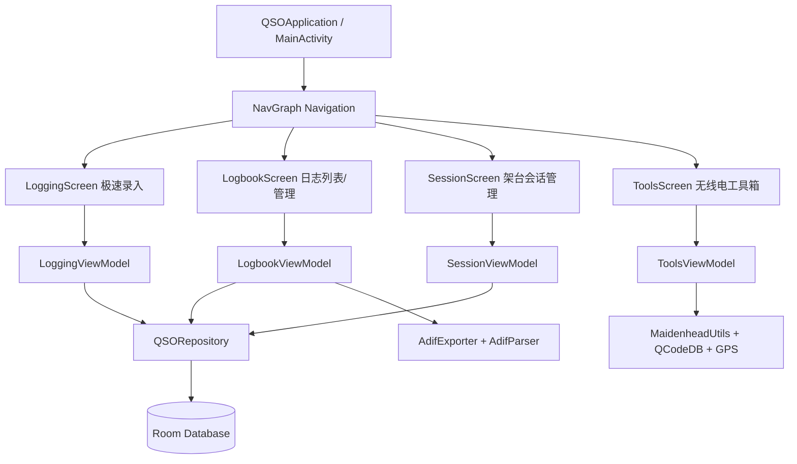

# Field QSO - 业余无线电户外通联日志实施计划

Field QSO 是一款专为业余无线电爱好者（HAM）打造的户外架台/野台/POTA/SOTA 通联记录 Android 原生 App。采用现代 **Jetpack Compose + Material Design 3 (MD3) + Room + Kotlin Coroutines Flow** 架构。

目前底层数据库实体、DAO、Repository、ADIF 导出及梅登黑德网格算法已就绪。本项目将完整实现应用的上层 UI、ViewModel、业务逻辑流、户外高对比度阳光模式、ADIF 导入/导出、GPS 网格定位与无线电工具箱。

---

## 🏗️ 架构与模块设计

---

## 📋 待实现与修改的文件清单

### 1. 基础架构与主题 (Theme & Core)
#### [NEW] [QSOApplication.kt](file:///d:/Dev/AntiGravity/Android%20QSO/app/src/main/java/com/ham/qso/QSOApplication.kt)
- 继承 `Application`，初始化 `AppDatabase` 和全局 `QSORepository` 单例容器。

#### [MODIFY] [AndroidManifest.xml](file:///d:/Dev/AntiGravity/Android%20QSO/app/src/main/AndroidManifest.xml)
- 注册 `QSOApplication`。
- 配置定位权限与文件导出相关提供者配置（如果需要）。

#### [NEW] [Color.kt](file:///d:/Dev/AntiGravity/Android%20QSO/app/src/main/java/com/ham/qso/ui/theme/Color.kt)
- 定义标准暗色/亮色调色板，以及专门为户外阳光直射设计的 **Sunshine 高对比度明亮调色板**（高饱和度金黄/纯黑/高对比度深蓝底色）。

#### [NEW] [Theme.kt](file:///d:/Dev/AntiGravity/Android%20QSO/app/src/main/java/com/ham/qso/ui/theme/Theme.kt)
- 支持三种主题模式：`System (Default)`, `Dark`, `Sunshine (Outdoor High Contrast)`，并支持 Android 12+ Dynamic Color。

#### [NEW] [Type.kt](file:///d:/Dev/AntiGravity/Android%20QSO/app/src/main/java/com/ham/qso/ui/theme/Type.kt)
- Material 3 字体排印规范，支持通联呼号专用的等宽字体样式展示。

---

### 2. 领域层扩展 (Domain Layer)
#### [NEW] [AdifParser.kt](file:///d:/Dev/AntiGravity/Android%20QSO/app/src/main/java/com/ham/qso/domain/adif/AdifParser.kt)
- 解析 ADIF 3.1.4 格式文本与 .adi 文件，提取呼号、频段、模式、RST、时间、网格并转换为 `QSOEntity` 批量导入。

#### [NEW] [QCodeData.kt](file:///d:/Dev/AntiGravity/Android%20QSO/app/src/main/java/com/ham/qso/domain/model/QCodeData.kt)
- 常用无线电 Q 简语数据库（QTH, QRM, QRN, QSB, QSL, QSO, QSY, QRP, QRO, 73, 88 等），提供速查检索。

---

### 3. 公共 UI 组件 (UI Components)
#### [NEW] [UtcClockHeader.kt](file:///d:/Dev/AntiGravity/Android%20QSO/app/src/main/java/com/ham/qso/ui/components/UtcClockHeader.kt)
- 顶部常驻 UTC 实时秒级跳动时钟与日期显示卡片。

#### [NEW] [BandModeSelector.kt](file:///d:/Dev/AntiGravity/Android%20QSO/app/src/main/java/com/ham/qso/ui/components/BandModeSelector.kt)
- 水平滚动快速切换 Chips（160m ~ 70cm 波段与 SSB/CW/FT8/FM 等模式），支持选中高亮与对应频率快速联动。

#### [NEW] [RstPicker.kt](file:///d:/Dev/AntiGravity/Android%20QSO/app/src/main/java/com/ham/qso/ui/components/RstPicker.kt)
- 预设常用 RST 快速选择器（如 59, 599, 57, 55, FT8 -05/-10/-15），减少户外输入按键次数。

#### [NEW] [DupeAlertCard.kt](file:///d:/Dev/AntiGravity/Android%20QSO/app/src/main/java/com/ham/qso/ui/components/DupeAlertCard.kt)
- 实时防重通联告警卡片（同会话同波段重复即时高亮预警）。

---

### 4. 功能页面与 ViewModel (Screens & ViewModels)

#### A. 极速户外录入 (Logging Screen)
#### [NEW] [LoggingViewModel.kt](file:///d:/Dev/AntiGravity/Android%20QSO/app/src/main/java/com/ham/qso/ui/screens/log/LoggingViewModel.kt)
- 管理录入表单状态、自动大写、实时防重检测流、继承当前架台参数、提交通联后自动保留频段模式并清空对方字段（Field Burst 模式）。
#### [NEW] [LoggingScreen.kt](file:///d:/Dev/AntiGravity/Android%20QSO/app/src/main/java/com/ham/qso/ui/screens/log/LoggingScreen.kt)
- 极速录入界面：呼号自动大写大字号输入框、RST 发送/接收选择器、波段/模式 Chips、折叠式高级详情（网格、对方天线/电台/功率/备注）、最近录入记录滚动条。

#### B. 通联日志列表与管理 (Logbook Screen)
#### [NEW] [LogbookViewModel.kt](file:///d:/Dev/AntiGravity/Android%20QSO/app/src/main/java/com/ham/qso/ui/screens/logbook/LogbookViewModel.kt)
- 日志列表管理：按当前会话/全部筛选、呼号关键词搜索、波段与模式过滤、单条记录编辑/删除、导出 ADIF/CSV 字符串与分享 Intent 生成、导入 ADIF 文件。
#### [NEW] [LogbookScreen.kt](file:///d:/Dev/AntiGravity/Android%20QSO/app/src/main/java/com/ham/qso/ui/screens/logbook/LogbookScreen.kt)
- 日志列表展示：卡片列表、搜索栏、波段过滤栏、单条详情/编辑弹窗、分享与导出/导入入口。

#### C. 架台会话管理 (Session Management Screen)
#### [NEW] [SessionViewModel.kt](file:///d:/Dev/AntiGravity/Android%20QSO/app/src/main/java/com/ham/qso/ui/screens/session/SessionViewModel.kt)
- 会话的创建、编辑、删除、激活切换，统计各会话总 QSO 数和独立呼号数。
#### [NEW] [SessionScreen.kt](file:///d:/Dev/AntiGravity/Android%20QSO/app/src/main/java/com/ham/qso/ui/screens/session/SessionScreen.kt)
- 架台列表视图、当前激活会话徽标卡片、新建/编辑会话对话框（配置我的呼号、我的网格、发射功率、电台、天线、POTA/SOTA/BOTA 编号）。

#### D. 无线电工具箱 (Radio Utilities Screen)
#### [NEW] [ToolsViewModel.kt](file:///d:/Dev/AntiGravity/Android%20QSO/app/src/main/java/com/ham/qso/ui/screens/tools/ToolsViewModel.kt)
- 获取 GPS 经纬度并换算 4/6 位梅登黑德网格、计算两地网格距离与大圆方位角、Q 简语搜索过滤。
#### [NEW] [ToolsScreen.kt](file:///d:/Dev/AntiGravity/Android%20QSO/app/src/main/java/com/ham/qso/ui/screens/tools/ToolsScreen.kt)
- 工具箱页面：GPS 定位网格卡片（一键应用到当前会话）、两地网格天线方位角与距离计算器、Q 简语速查卡片。

---

### 5. 导航与主入口 (Navigation & Main Entry)
#### [NEW] [Screen.kt](file:///d:/Dev/AntiGravity/Android%20QSO/app/src/main/java/com/ham/qso/ui/navigation/Screen.kt)
- 导航路由定义（Logging, Logbook, Sessions, Tools）。
#### [NEW] [NavGraph.kt](file:///d:/Dev/AntiGravity/Android%20QSO/app/src/main/java/com/ham/qso/ui/navigation/NavGraph.kt)
- 导航图与 Compose 页面路由映射。
#### [NEW] [MainActivity.kt](file:///d:/Dev/AntiGravity/Android%20QSO/app/src/main/java/com/ham/qso/MainActivity.kt)
- 主 Activity，包含 MD3 `Scaffold`、底部导航栏 (`NavigationBar`)、顶部栏（包含主题模式切换器：标准/暗黑/Sunshine 户外阳光模式）、权限请求处理。

---

## 🧪 验证计划

### 1. 单元与集成测试 (Automated Unit Tests)
- 编写 `MaidenheadUtilsTest.kt`：测试经纬度与网格互转、两地距离与方位角计算精度。
- 编写 `AdifExportImportTest.kt`：测试 ADIF 3.1.4 格式导出与反向解析导入的一致性与完整性。
- 编写 `DupeCheckTest.kt`：验证同会话同波段防重逻辑。

### 2. 编译与运行验证
- 使用 Gradle 执行测试与编译检查：
  - `./gradlew test`
  - `./gradlew assembleDebug`
- 检查 APK 输出与构建产物。
